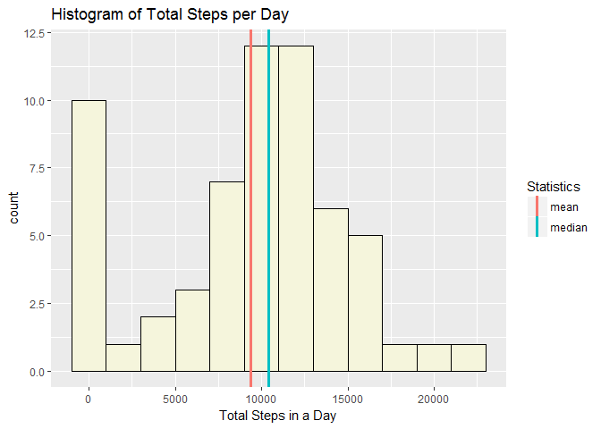
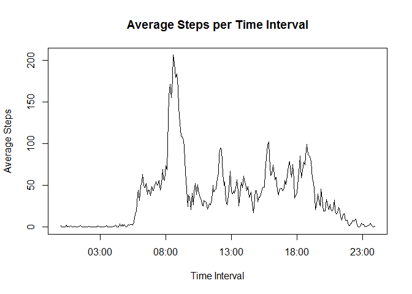
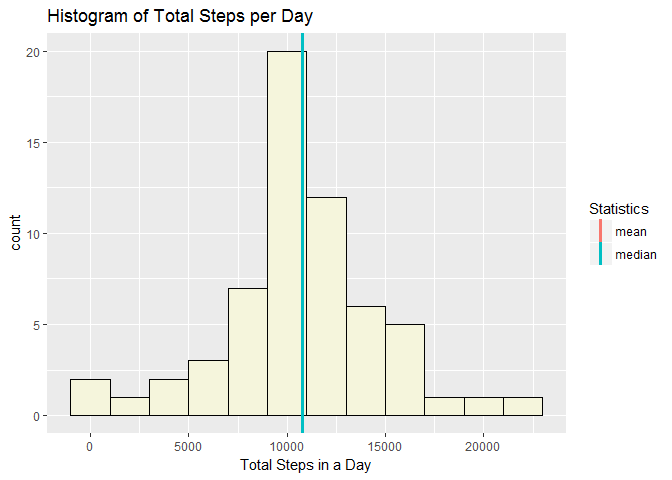
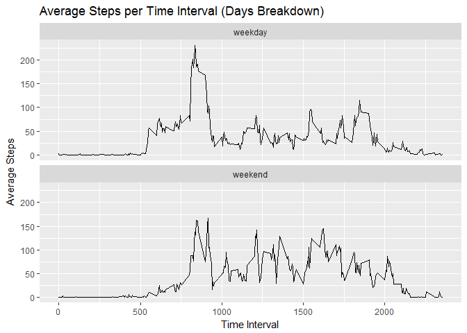

Set caching and echoing options first.


```r
knitr::opts_chunk$set(cache = TRUE, echo = TRUE)
```

## Loading and preprocessing the data
Unzip the file first and read the data set.


```r
filename = "activity.zip"
if (!file.exists("activity")){
        unzip(filename)
}

activity = read.csv("activity.csv", na.strings = "NA")
```

See what the data look like.


```r
head(activity)
```

```
##   steps       date interval
## 1    NA 2012-10-01        0
## 2    NA 2012-10-01        5
## 3    NA 2012-10-01       10
## 4    NA 2012-10-01       15
## 5    NA 2012-10-01       20
## 6    NA 2012-10-01       25
```

```r
str(activity)
```

```
## 'data.frame':	17568 obs. of  3 variables:
##  $ steps   : int  NA NA NA NA NA NA NA NA NA NA ...
##  $ date    : Factor w/ 61 levels "2012-10-01","2012-10-02",..: 1 1 1 1 1 1 1 1 1 1 ...
##  $ interval: int  0 5 10 15 20 25 30 35 40 45 ...
```

It seems we have read the table correctly. The date column is recognized as a date object, that is fine. Add a time variable to denote the intervals as times in a day.


```r
activity$time = as.POSIXct(sprintf("%04.0f", activity$interval), format='%H%M')
```

## What is mean total number of steps taken per day?
Load dplyr package to transform data and ggplot2 to plot the histogram.


```r
library(dplyr)
library(ggplot2)
```
Find total number of steps taken per day and have a look at it.


```r
tib1 = activity %>% group_by(date) %>% summarize(totalSteps = sum(steps, na.rm = TRUE))
head(tib1)
```

```
## # A tibble: 6 x 2
##   date       totalSteps
##   <fct>           <int>
## 1 2012-10-01          0
## 2 2012-10-02        126
## 3 2012-10-03      11352
## 4 2012-10-04      12116
## 5 2012-10-05      13294
## 6 2012-10-06      15420
```

Plot a histogram.


```r
ggplot(data = tib1, aes(x = totalSteps)) + geom_histogram(binwidth = 2000, fill = "beige", color = "black") + xlab("Total Steps in a Day") + ggtitle("Histogram of Total Steps per Day") + geom_vline(aes(xintercept = mean(totalSteps), color = "mean"), size = 1.2) + geom_vline(aes(xintercept = median(totalSteps), color = "median"), size = 1.2) + guides(color = guide_legend(title = "Statistics"))
```

<!-- -->

Report the mean and median values.


```r
meantotS = mean(tib1$totalSteps)
mediantotS = median(tib1$totalSteps)
```

Mean number of total number of steps taken per day is 9354.2295082 and the median is 10395.

## What is the average daily activity pattern?
Similar to the process above, group the steps according to times and take their average.


```r
tib2 = activity %>% group_by(time) %>% summarize(intervalSteps = mean(steps, na.rm = T))
head(tib2)
```

```
## # A tibble: 6 x 2
##   time                intervalSteps
##   <dttm>                      <dbl>
## 1 2018-06-13 00:00:00        1.72  
## 2 2018-06-13 00:05:00        0.340 
## 3 2018-06-13 00:10:00        0.132 
## 4 2018-06-13 00:15:00        0.151 
## 5 2018-06-13 00:20:00        0.0755
## 6 2018-06-13 00:25:00        2.09
```

Plot as a time series graph.


```r
plot(intervalSteps ~ time, data = tib2, type = "l", main = "Average Steps per Time Interval", xlab = "Time Interval", ylab = "Average Steps")
```

<!-- -->

Find and print the time interval with maximum average steps.


```r
print.data.frame(tib2[which.max(tib2$intervalSteps),])
```

```
##                  time intervalSteps
## 1 2018-06-13 08:35:00      206.1698
```

## Imputing missing values
Find number of rows with missing values.


```r
nas = sum(rowSums(is.na(activity)))
```

There are 2304 rows in total with missing values. Now, duplicate the data set and replace the missing values with the mean values for the corresponding time interval.


```r
activity2 = activity
activity2$steps = ifelse(is.na(activity$steps), tib2$intervalSteps, activity2$steps)
```

Draw the histogram with imputed values.


```r
tib3 = activity2 %>% group_by(date) %>% summarize(totalSteps = sum(steps, na.rm = TRUE))

ggplot(data = tib3, aes(x = totalSteps)) + geom_histogram(binwidth = 2000, fill = "beige", color = "black") + xlab("Total Steps in a Day") + ggtitle("Histogram of Total Steps per Day") + geom_vline(aes(xintercept = mean(totalSteps), color = "mean"), size = 1.2) + geom_vline(aes(xintercept = median(totalSteps), color = "median"), size = 1.2) + guides(color = guide_legend(title = "Statistics"))
```

<!-- -->

Find the new mean and median values.


```r
meantotS2 = mean(tib3$totalSteps)
mediantotS2 = median(tib3$totalSteps)

df = data.frame(mean = meantotS2, median = mediantotS2)
df
```

```
##       mean   median
## 1 10766.19 10766.19
```

It seems that the median has increased a little bit, and the mean value has converged to the median value. Increase in mean was expected since the number of the days is the same, but the total steps taken in a day has increased due to imputed values. The increase in median may be the sign that the most of the missing values belong to a similar pattern. It is also significant how the "0-bin" in the first histogram diminishes in the second one.

## Are there differences in activity patterns between weekdays and weekends?

Identify the days of the week first. Then distinguish them with respect to being a weekday or weekend, and then convert the names of the week to English.


```r
activity2$days = weekdays(as.Date(activity$date))
activity2$weekdays[activity2$days == "Pazartesi"] = "weekday"
activity2$weekdays[activity2$days == "Salý"] = "weekday"
activity2$weekdays[activity2$days == "Çarþamba"] = "weekday"
activity2$weekdays[activity2$days == "Perþembe"] = "weekday"
activity2$weekdays[activity2$days == "Cuma"] = "weekday"
activity2$weekdays[activity2$days == "Cumartesi"] = "weekend"
activity2$weekdays[activity2$days == "Pazar"] = "weekend"

activity2$days[activity2$days == "Pazartesi"] = "Monday"
activity2$days[activity2$days == "Salý"] = "Tuesday"
activity2$days[activity2$days == "Çarþamba"] = "Wednesday"
activity2$days[activity2$days == "Perþembe"] = "Thursday"
activity2$days[activity2$days == "Cuma"] = "Friday"
activity2$days[activity2$days == "Cumartesi"] = "Saturday"
activity2$days[activity2$days == "Pazar"] = "Sunday"
```

Now, find the average steps taken for the intervals and convert the result to a data frame.


```r
tib4 = activity2 %>% group_by(interval, weekdays) %>% summarize(intervalSteps = mean(steps, na.rm = T))
tib4 = as.data.frame(tib4)
head(tib4)
```

```
##   interval weekdays intervalSteps
## 1        0  weekday    2.25115304
## 2        0  weekend    0.21462264
## 3        5  weekday    0.44528302
## 4        5  weekend    0.04245283
## 5       10  weekday    0.17316562
## 6       10  weekend    0.01650943
```

Voila. Make the plot with the weekday/weekend breakdown.


```r
ggplot(data = tib4, aes(x = interval, y = intervalSteps)) + geom_line() + facet_wrap(~as.factor(weekdays), nrow = 2) + ylab("Average Steps") + xlab("Time Interval") + ggtitle("Average Steps per Time Interval (Days Breakdown)")
```

<!-- -->
